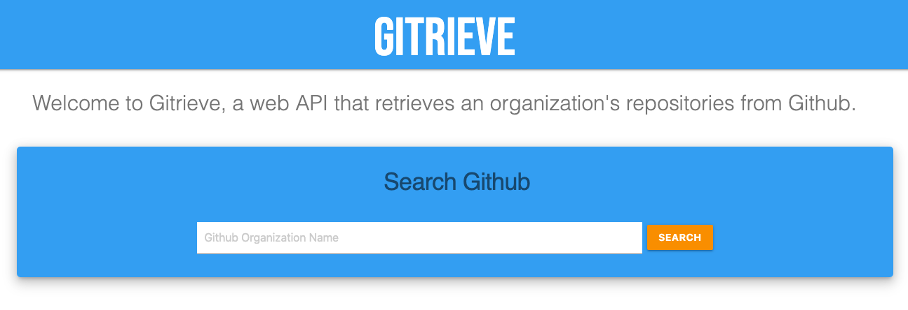
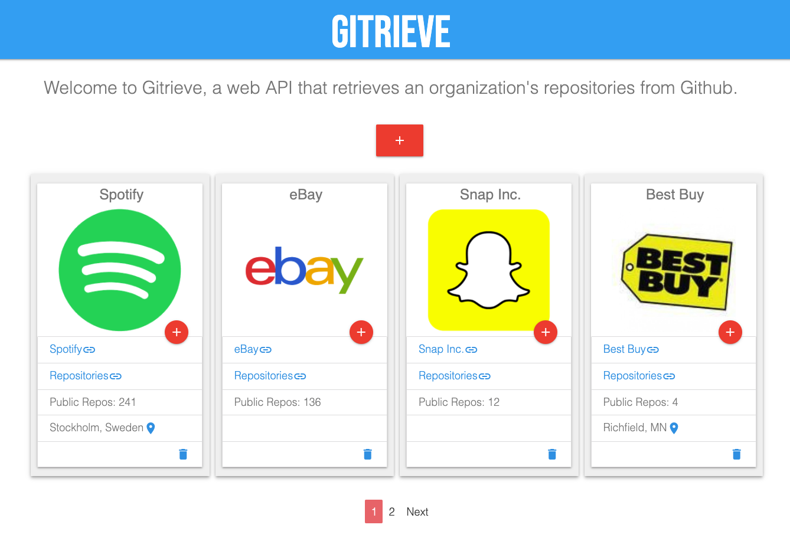
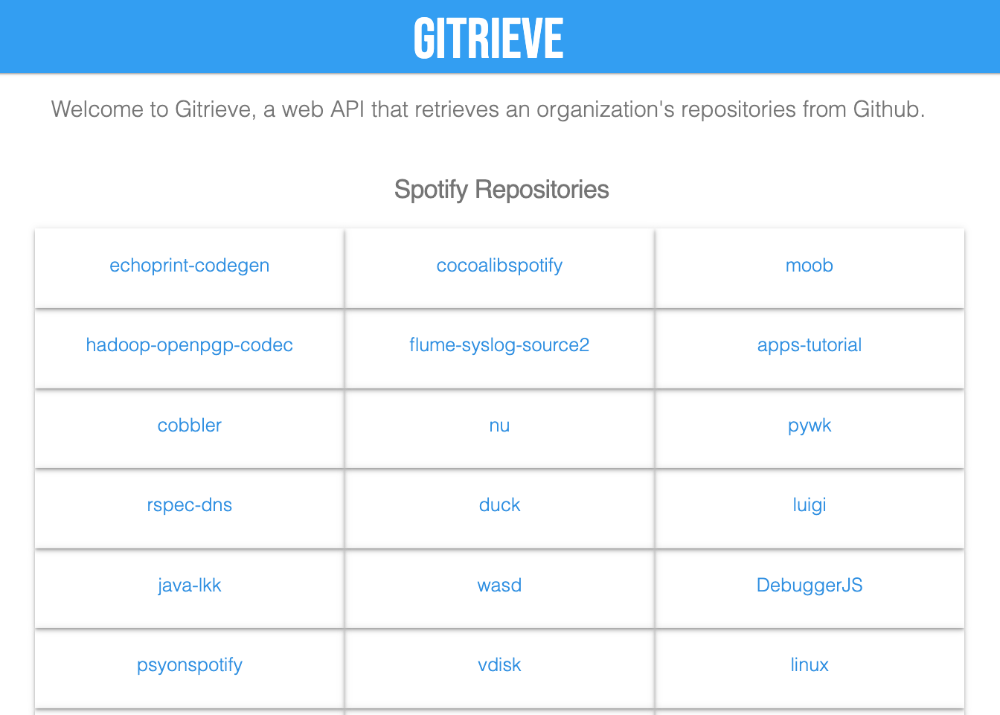

# Gitrieve a Github API App

This Gitrieve App utilizes the [Tentacat](https://hexdocs.pm/tentacat/readme.html)(Simple Elixir Wrapper for Github API) dependency to search and retrieve an organization's public repositories. The retrieved data is then displayed showing an organization's name, location(if available), public repos, repositories, and avatar. This app was written in Elixir, Phoenix, and PostgresSQL. [Materialize](https://materializecss.com/showcase.html) CSS was used for styling.

To start your Phoenix server:

  * Install dependencies with `mix deps.get`
  * Create and migrate your database with `mix ecto.setup`
  * Install Node.js dependencies with `cd assets && npm install`
  * Run source config/.env
  * Start Phoenix endpoint with `mix phx.server`

Now you can visit [`localhost:4000`](http://localhost:4000) from your browser.

Ready to run in production? Please [check our deployment guides](https://hexdocs.pm/phoenix/deployment.html).

## Learn more

  * Official website: http://www.phoenixframework.org/
  * Guides: https://hexdocs.pm/phoenix/overview.html
  * Docs: https://hexdocs.pm/phoenix
  * Mailing list: http://groups.google.com/group/phoenix-talk
  * Source: https://github.com/phoenixframework/phoenix
